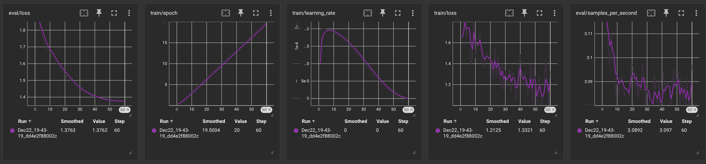

# Fine tuned Llama 2 7B for HTML Code generation

## About
- This is fine tuned Llama 2 which generates HTML code for a given piece of prompt.
- It has been trained using QLoRA (Quantized Low Rank Adaptation) for maximizing the model training performance while keeping the GPU demands reasonably low for training and inference.
- Model chosen for fine-tuning : [NousResearch/Llama-2-7b-chat-hf](https://huggingface.co/NousResearch/Llama-2-7b-chat-hf)
- Trained on retr0sushi04/html_pre_processed can be found on HuggingFace : [dataset](https://huggingface.co/datasets/retr0sushi04/html_pre_processed) which is a preprocessed version of [raw dataset](https://huggingface.co/datasets/jawerty/html_dataset).

## Requirements
- Requirements are listed in requirements.txt and are as follows :
- `torch==2.1.0
  transformers==4.31.0 
  trl==0.4.7 
  bitsandbytes==0.40.2 
  peft==0.4.0 
  accelerate==0.21.0`
- Installation :
- `pip install torch==2.1.0
  transformers==4.31.0 
  trl==0.4.7 
  bitsandbytes==0.40.2 
  peft==0.4.0 
  accelerate==0.21.0`
- **NOTE**: Install torch with CUDA support if using on GPU for even faster training.
  
## Model & Dataset Selection
- Model Selected : [NousResearch/Llama-2-7b-chat-hf](https://huggingface.co/NousResearch/Llama-2-7b-chat-hf)
  - 7B fine-tuned Llama 2 optimized for dialogue use cases.
- Dataset Selected : [raw dataset](https://huggingface.co/datasets/jawerty/html_dataset)
  - Pre processed and uploaded further to HuggingFace as [dataset](https://huggingface.co/datasets/retr0sushi04/html_pre_processed)
 
## Training Specifications
-  Trained using QLoRA for quantized low precision training in 4-bit for less training time and better performance on the selected dataset.
-  Used BitsAndBytes for loading the quantized model from HuggingFace.
-  Bits and Bytes config is given below :
   ```Python
    from transformers import BitsAndBytesConfig
    load_in_4bit = True
    bnb_4bit_quant_type = "nf4"
    bnb_4bit_use_double_quant=False
    
    compute_dtype = getattr(torch, "float16")
    
    quantization_config = BitsAndBytesConfig(
        load_in_4bit = load_in_4bit,
        bnb_4bit_quant_type = bnb_4bit_quant_type,
        bnb_4bit_compute_dtype=compute_dtype,
        bnb_4bit_use_double_quant=bnb_4bit_use_double_quant
    )
   ```
- Further the training required the LoRA Config which is as follows :
  ```Python
    from transformers import LoraConfig
    lora_alpha = 16
    lora_dropout = 0.1
    r = 64
    bias = "none"
    task_type = "CAUSAL_LM"
    
  
    peft_parameters = LoraConfig(
      lora_alpha=lora_alpha,
      lora_dropout=lora_dropout,
      r=r,
      bias=bias,
      task_type=task_type
    )
  ```
- And next the training arguments are set :
  ```Python
    from transformers import TrainingArguments

    # Training Parameters
    output_dir="./results"
    num_train_epochs=3
    per_device_train_batch_size=4
    per_device_eval_batch_size=4
    gradient_accumulation_steps=1
    gradient_checkpointing=True
    optim="paged_adamw_32bit"
    save_steps=0
    logging_steps=1
    evaluation_strategy="steps"
    learning_rate=2e-4
    weight_decay=0.001
    fp16=False
    bf16=False
    max_grad_norm=0.3
    max_steps=-1
    warmup_ratio=0.03
    group_by_length=True
    lr_scheduler_type="cosine"
    report_to="tensorboard"
    
    
    training_args = TrainingArguments(
        output_dir=output_dir,
        num_train_epochs=num_train_epochs,
        per_device_train_batch_size=per_device_train_batch_size,
        gradient_accumulation_steps=gradient_accumulation_steps,
        evaluation_strategy=evaluation_strategy,
        optim=optim,
        save_steps=save_steps,
        logging_steps=logging_steps,
        learning_rate=learning_rate,
        weight_decay=weight_decay,
        fp16=fp16,
        bf16=bf16,
        max_grad_norm=max_grad_norm,
        max_steps=max_steps,
        warmup_ratio=warmup_ratio,
        group_by_length=group_by_length,
        lr_scheduler_type=lr_scheduler_type,
        report_to=report_to
    )
  ```
- And after the BitsAndBytes, LoRA and Training args are set they are passed into the Supervised Fine Tuning Trainer and a `trainer` instance is created :
  ```Python
    from trl import SFTTrainer
    from lora_config import peft_parameters
    from train_params import training_args
    from get_model import model, tokenizer
    from get_dataset import dataset
    
    def get_trainer(model, training_args, tokenizer):
        trainer = SFTTrainer(
            model=model,
            train_dataset=dataset['train'],
            eval_dataset=dataset['test'],
            peft_config=peft_parameters,
            dataset_text_field="text",
            max_seq_length=None,
            tokenizer=tokenizer,
            args=training_args,
            packing=False
        )
        return trainer
  ```
**NOTE** : The above examples may slightly differ from the training script.
## Evals
- Below are the training and validation graphs for the training :
  
  

## Inference 

## Imporvements and possible challenges
